# 内置第三方插件市场预设（Builtin Third-Party Marketplaces）设计

日期：2026-10-10
状态：已与用户对齐方案（代码内置，非配置级）

## 背景与目标

ZCode 商店目前只有一个官方市场（`zcode-plugins-official`）加用户手动添加的个人来源。GitHub 上
Claude 插件生态存在多个成熟的第三方市场仓库（`.claude-plugin/marketplace.json` 格式，条目 source
形态全部在现有解析器支持范围内，已逐一实测验证）。目标：把其中经过筛选的 8 个市场作为出厂
预设内置，用户打开商店即可见，无需手动输入地址。

预设清单（全部实测：manifest 可拉取、条目 source 为 relpath/github/git-subdir/url(.git) 形态）。
预设 id 必须等于上游 manifest 自声明的 `name`——物化路径 addMarketplace 的 expectedId 守卫按
「声明 id = manifest name」fail closed，不一致抛 Marketplace declaration id mismatch：

| id                             | repo                                     | 规模                         |
| ------------------------------ | ---------------------------------------- | ---------------------------- |
| `claude-code-workflows`        | wshobson/agents                          | 94 插件（agents + commands） |
| `claude-community`             | anthropics/claude-plugins-community      | 2284 插件                    |
| `skills-curated`               | trailofbits/skills-curated               | 29 插件                      |
| `cc-marketplace`               | ananddtyagi/cc-marketplace               | 119 插件                     |
| `claude-code-hooks`            | karanb192/claude-code-hooks              | 22 插件（hooks）             |
| `gptaku-plugins`               | fivetaku/gptaku_plugins                  | 18 插件                      |
| `n-skills`                     | numman-ali/n-skills                      | 5 插件                       |
| `power-bi-agentic-development` | data-goblin/power-bi-agentic-development | 13 插件                      |

不入选：`Piebald-AI/claude-code-lsps`（lspServers 组件 ZCode 仅诊断不支持，用户装了只收获诊断）。

## 产品规则

1. **声明惰性**：内置预设只进入"声明层"，启动/读配置不联网、不 clone、不写盘。只有用户显式
   动作（商店手动刷新、安装、CLI update）才物化（复用 `materializeDeclaredMarketplaceForExplicitAction`）。
   Catalog Auto-Refresh 只覆盖官方市场，不受影响。
2. **不预装**：预设只提供来源目录；任何插件安装仍是用户显式动作。预设 ≠ 受信来源，商店展示
   与个人来源同Segment，不冒充官方。
3. **可移除、移除不复活**：用户移除内置预设市场时，除删除物化记录外，还要把 id 写入
   `plugins.suppressedBuiltinMarketplaces`；合并层据此剔除该预设。用户之后仍可通过"添加个人
   来源"手动重加（走普通个人来源路径，不经过内置层）。
4. **用户声明优先**：user config 的 `plugins.extraKnownMarketplaces[同 id]` 覆盖内置预设的
   source（用户改指向自己的 fork 等）。suppression 只作用于内置层，不抑制用户显式声明。
5. **官方 id 守卫**：内置表 id 由编译期常量保证不等于 `zcode-plugins-official`；运行时合并层
   复用现有 official id 守卫逻辑。

## 状态所有者

三层合并，无新增状态文件（抑制记录放 user config，物化记录复用 known_marketplaces.json）：

| 层     | 内容                                                                                                           | 所有者                                                     |
| ------ | -------------------------------------------------------------------------------------------------------------- | ---------------------------------------------------------- |
| 内置层 | `BUILTIN_THIRD_PARTY_MARKETPLACES` 常量（packages/shared）                                                     | 代码常量，无运行时状态                                     |
| 声明层 | user config `plugins.extraKnownMarketplaces`（用户声明）与 `plugins.suppressedBuiltinMarketplaces`（用户抑制） | `~/.zcode/cli/config.json`，adapters 原子写                |
| 物化层 | `plugins/marketplaces/<id>/marketplace.json` + known_marketplaces.json 记录                                    | 现有 marketplace 管线（addMarketplace/update/manifestize） |

合并规则（`resolveDeclaredMarketplaceSources` 输入扩展）：内置层（剔除被抑制 id）→ user config
声明（同 id 覆盖内置）→ 与 known_marketplaces 物化记录合并（现有逻辑不变）。

## 事件顺序

```dot
digraph {
  rankdir=LR;
  bootstrap [label="启动/overview 读取\n(不联网)", shape=box];
  merge [label="resolveDeclaredMarketplaceSources\n内置(去抑制) + user config 覆盖", shape=box];
  effective [label="resolveEffectiveMarketplaceRecords\n+ known_marketplaces 物化记录", shape=box];
  store [label="商店来源列表\n(预设 pluginCount=0 未物化)", shape=box];
  refresh [label="用户显式刷新/安装\nmaterializeDeclaredMarketplaceForExplicitAction\n(联网 clone, 原子激活)", shape=box];
  known [label="known_marketplaces.json\n(物化记录, pluginCount>0)", shape=box];
  remove [label="用户移除内置预设\nremoveMarketplace + 写 suppressedBuiltinMarketplaces", shape=box];

  bootstrap -> merge -> effective -> store;
  store -> refresh -> known -> effective;
  store -> remove -> merge [label="抑制后不再出现"];
}
```

## 接口改动

1. `packages/shared/src/plugin-marketplaces.ts`：新增
   `BUILTIN_THIRD_PARTY_MARKETPLACES: readonly BuiltinThirdPartyMarketplace[]`（`{id, repo,
description}`）与 `isBuiltinThirdPartyMarketplaceId(id)`。
2. `apps/zcode-cli/packages/adapters/src/config/schema.ts`：`plugins.suppressedBuiltinMarketplaces:
z.array(z.string().min(1)).optional()`（对齐现有 `suppressedBuiltins` 命名与形态）。
3. `apps/zcode-cli/packages/adapters/src/config/file-config.adapter.ts`：
   `addSuppressedBuiltinMarketplaceInFileConfig(filePath, marketplaceId)`（原子写、幂等，
   镜像 `addSuppressedBuiltinInFileConfig`）。
4. `apps/zcode-cli/packages/bootstrap/src/plugins.ts`：
   - `resolveDeclaredMarketplaceSources` 合并内置层（读 `configResult.config.plugins.
suppressedBuiltinMarketplaces` 剔除，再被 user config 同 id 声明覆盖）。
   - `removeZCodePluginMarketplace`：被移除 id 属于内置预设时，额外调用
     `addSuppressedBuiltinMarketplaceInFileConfig(configResult.sources.user.path, id)`。
5. CLI 命令与桌面 UI：零改动（`zcode plugins marketplace list` 与商店走同一 effective 合并层）。

## 验收场景

1. 全新用户：商店来源列表出现 8 个内置预设（pluginCount 0，未物化），不发生任何网络请求。
2. 用户对内置预设点刷新/安装：市场被物化（clone、原子激活、known 记录、条目可见）。
3. 用户移除内置预设：来源消失；重启后不复活（suppression 生效）；手动 Add marketplace 重加
   后可作为普通个人来源使用。
4. 用户在 config `extraKnownMarketplaces` 声明与内置预设同 id 的不同 source：以用户声明为准。
5. suppression 中的 id 出现在用户 config 声明里：用户声明仍然生效（抑制只作用于内置层）。
6. 官方 id 安全：内置表 id 恒不等于官方市场 id（静态断言 + 守卫）。
7. `pnpm typecheck`、`pnpm lint`、`pnpm architecture:check --changed` 通过；新增测试
   （adapters config patch、bootstrap overview 合并/抑制）通过。

## 边界与失败语义

- 内置预设物化失败（网络/仓库不可达）：现有 addMarketplace/update 的失败语义与持久化
  refresh failure 机制不变，预设保持未物化（pluginCount 0），不产生错误弹窗风暴。
- 旧版本升级：无迁移；suppression 字段缺省即"未抑制"，内置层自然出现。
- 预设清单是编译期常量，调整清单 = 发版；用户侧不受影响（已物化的记录在 known 层，不随
  常量消失）。
